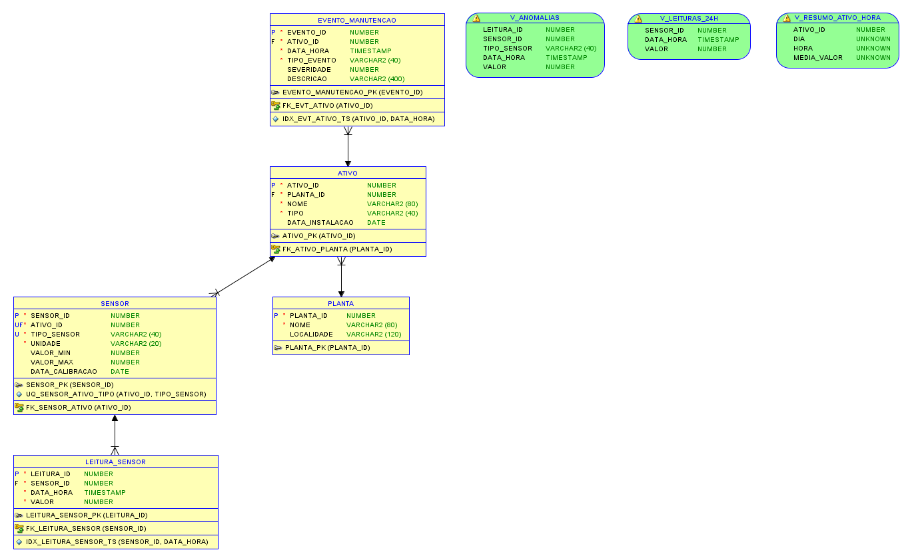
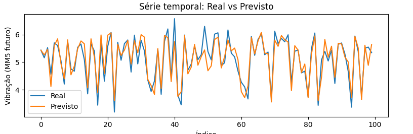
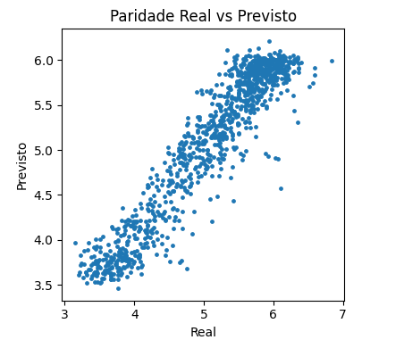
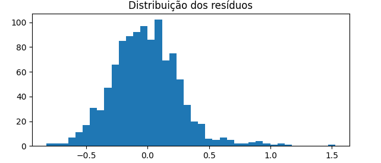

# Enterprise Challenge - Sprint 3 - Reply

## 👤 Integrante
- **Nome:** Robson Alves Costa  
- **RM:** 565066  
- **Curso:** Inteligência Artificial – FIAP  
- **Fase:** 5-SET-2025

---

## 📌 Introdução
Repositório da **Fase 5 – Hermes Reply** com solução fim a fim:
**Banco de Dados (Oracle)** para séries temporais de sensores (DDL, views, inserts, consultas) e
**Machine Learning (Regressão)** que prevê vibração em **+10 min** com métricas e gráficos.

---

## 📂 Estrutura do Repositório
- **`README.md`** → Este documento introdutório, com explicação geral do projeto e instruções.  
- `db/hermes_reply_fase5_modelo_relacional_rm565066.dmd` — **arquivo DMD do Data Modeler**
- `db/hermes_reply_fase5_modelo_relacional_rm565066` — **pasta com os arquivos criados pelo Data Modeler**
- `db/schema_oracle_rm565066.sql` — **schema de criação do banco de dados**
- `db/script_insert_dados_rm565066.sql` — **script de criação de registros no banco de dados**
- `db/consultas_demo_rm565066.sql` — **consultas úteis de demonstração**
- `docs/dicionario_dados_rm565066.csv` — **dicionário de dados**
- `data/leituras_sensores.csv` — **base simulada (por sensor, por data/hora)**
- `data/metricas_ativos_regressao.csv` — **base para Machine Learning (features + target)**
- `notebooks/ml_regressao_rm565066.ipynb` — **arquivo do notebook**
- `assets/schema_oracle_Data_Modeler_rm565066.png` — **DER do banco de dados**
- `assets/Distribuicao_rm565066.png`, `assets/Paridade_rm565066.png`, `assets/Serie_Temporal_rm565066.png` — **gráficos do notebook**
- `assets/Paridade_rm565066.png`, `assets/Paridade_rm565066.png`, `assets/Paridade_rm565066.png` — **gráficos do notebook**
- `assets/Serie_Temporal_rm565066.png`, `assets/Serie_Temporal_rm565066.png`, `assets/Serie_Temporal_rm565066.png` — **gráficos do notebook**

---

## ▶️ Explicação do projeto em Vídeo
🔗 [Clique aqui para assistir ao vídeo do Notebook no YouTube](https://youtu.be/WZcXjdwZhvI)

## 🧰 Passo a passo — Banco de Dados (Oracle)

1. **Modelo e DER**
- Modelagem normalizada com tabelas **PLANTA**, **ATIVO**, **SENSOR**, **LEITURA_SENSOR**, **EVENTO_MANUTENCAO**.
- Relações 1:N: PLANTA→ATIVO, ATIVO→SENSOR, SENSOR→LEITURA_SENSOR, ATIVO→EVENTO; PK/FK em todas.
- Regras: **UNIQUE** (ATIVO_ID, TIPO_SENSOR) e **CHECK** (TIPO_SENSOR, UNIDADE, VALOR, TIPO_EVENTO/SEVERIDADE).
- Índices por tempo e **views**: `V_LEITURAS_24H`, `V_RESUMO_ATIVO_HORA`, `V_ANOMALIAS`.
2. **Criar o schema**
- Importe e rode `db/schema_oracle_rm565066.sql` (Oracle 12c+ com IDENTITY).
3. **Popular com dados da simulação**
- **Dica:** garanta o formato de timestamp antes do insert: ALTER SESSION SET NLS_TIMESTAMP_FORMAT = 'YYYY-MM-DD"T"HH24:MI:SS';

## 🤖 Passo a passo — Machine Learning (Regressão)

1. Abra `notebooks/ml_regressao_rm565066.ipynb` no Colab (ou local).  
2. Garanta os CSVs em `data/`:
   - `data/metricas_ativos_regressao.csv` (base para Machine Learning)
   - `data/leituras_sensores.csv` (base longa; usada se precisar reconstruir)
3. Execute as células — o notebook compara **LinearRegression**, **RandomForest**, **GradientBoosting** (métricas: **MAE**, **RMSE**, **R²**) e salva gráficos em `assets/`.
4. Se o CSV não estiver no mesmo nível do notebook, use:
   - import pandas as pd
   - df = pd.read_csv('/content/data/metricas_ativos_regressao.csv')

## 🖼️ Imagens e explicações

### 1) Diagrama de Entidade e Relacionamento

**O que demonstra na imagem:**  
- Entidades **PLANTA**, **ATIVO**, **SENSOR**, **LEITURA_SENSOR**, **EVENTO_MANUTENCAO**.  
- Cardinalidades principais: `PLANTA 1:N ATIVO`, `ATIVO 1:N SENSOR`, `SENSOR 1:N LEITURA_SENSOR`, `ATIVO 1:N EVENTO_MANUTENCAO`.  
- Campos e chaves evidenciados (P=PK, F=FK, U=UNIQUE, *=NOT NULL).  
**Por que está assim:** layout otimizado e cores leves para leitura em telas e relatórios.

### 2) Série temporal — Real vs. Previsto (regressão)

**O que mostra:** comparação das primeiras amostras do conjunto de teste, entre o valor real da **vibração média móvel (+10 min)** e o valor **previsto** pelo melhor modelo.  
**Por que é útil:** evidencia a aderência do modelo ao padrão temporal.

### 3) Dispersão (Paridade) — Real vs. Previsto

**O que mostra:** cada ponto representa um par *(y_real, y_previsto)*.  
**Como ler:** quanto mais os pontos estiverem próximos da diagonal, melhor a performance.  
**Uso:** rápida verificação de viés e dispersão do erro.

### 4) Distribuição dos resíduos

**O que mostra:** histograma dos **resíduos** *(erro = real − previsto)*.  
**Como ler:** distribuição aproximadamente centrada em 0 e sem caudas muito longas sugere bom ajuste e ausência de viés sistemático.

---

## 🧪 Validações e boas práticas aplicadas
- **Constraints** (PK, FK, UNIQUE, CHECK) para integridade.  
- **Índices** por tempo e FK para performance.  
- **Views** para análise rápida (24h, médias por hora e anomalias).  
- **Feature engineering** com médias móveis e **target futuro** (+10 min).  
- **Comparação de modelos** e análise de **resíduos**.

---
